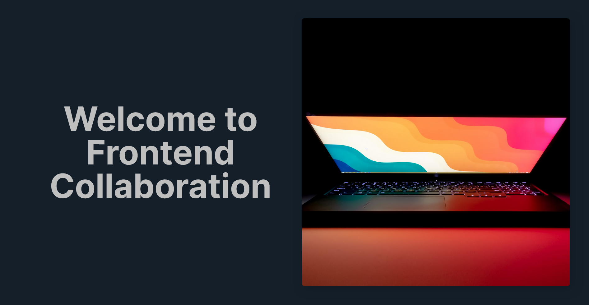

# Frontend Collaboration Landing Page

## Menu

- [About](#about)
- [Members](#members)
- [Projects](#projects)
- [Contribution](#contribution)
- [Credits](#credits)

## About

We're a team of designers and developers passionate about creating amazing online experiences. At the moment our focus is on building projects from the [Frontend Mentor](https://www.frontendmentor.io/) platform but we are open to working on all types of front-end web development projects.

We work together to create stunning projects that showcase not only our individual coding skills but also our ability to collaborate and help each other grow and learn. [Join us](https://discord.gg/NYHfjtZE) as we push boundaries to ehance our skills and development, one project at a time. [New contributions](https://github.com/josh76543210/Frontend-collaboration-landing-page)</a> are always welcome!

Live site: [https://f-r-o-n-t-e-n-d-c-o-l-l-a-b.netlify.app/](https://f-r-o-n-t-e-n-d-c-o-l-l-a-b.netlify.app/)

## Members

- [@josh76543210](https://github.com/josh76543210)
- [@Leroy-sama](https://github.com/Leroy-sama)
- [@SoloLere](https://github.com/SoloLere)
- [@ShalomiAhavah](https://github.com/ShalomiAhavah)

## Projects

- [Frontend Mentor - Huddle landing page solution](https://wonderful-cranachan-afb020.netlify.app/)
- [Frontend Mentor - Loopstudios landing page solution](https://frontend-mentor-loopstudios-page.netlify.app/)

## Contribution:

- Fork the repository (repo) to your own GitHub account
- Clone the project to your PC (Git)
- Create a new branch locally with a succinct but descriptive name
- Make changes (edit, delete, copy, add) on the new brach
- Commit changes to the branch
- Push changes to your fork (repo)
- Open a Pull Request (PR) in the project repository.
- Wait for your contribution to be accepted (merged) or declined to fix issues.

## Credits

Landing page created by [@josh76543210](https://github.com/josh76543210) - August 2023
